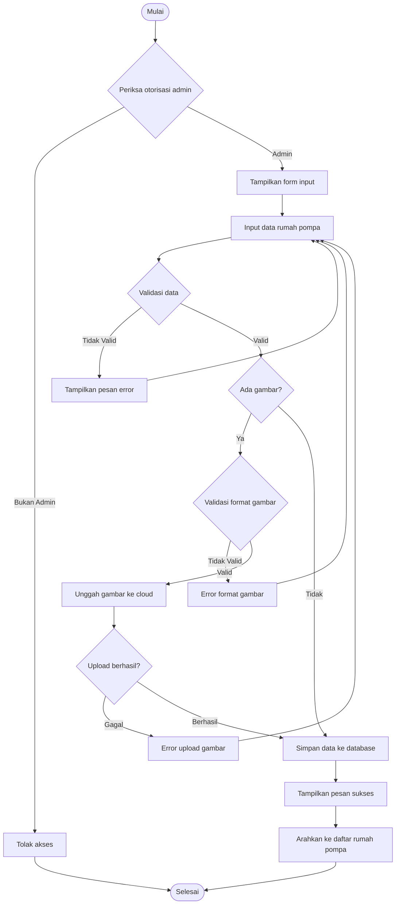

```mermaid
---
config:
  look: classic
---
flowchart TD
    Mulai([Mulai]) --> CekOtorisasi{Periksa otorisasi admin}
    CekOtorisasi -->|Bukan Admin| TolakAkses[Tolak akses]
    CekOtorisasi -->|Admin| TampilkanForm[Tampilkan form input]
    TampilkanForm --> InputData[Input data rumah pompa]
    InputData --> ValidasiData{Validasi data}
    ValidasiData -->|Tidak Valid| TampilkanError[Tampilkan pesan error]
    TampilkanError --> InputData
    ValidasiData -->|Valid| CekGambar{Ada gambar?}
    CekGambar -->|Ya| ValidasiGambar{Validasi format gambar}
    ValidasiGambar -->|Tidak Valid| TampilkanErrorGambar[Error format gambar]
    TampilkanErrorGambar --> InputData
    ValidasiGambar -->|Valid| UnggahGambar[Unggah gambar ke cloud]
    UnggahGambar --> CekUpload{Upload berhasil?}
    CekUpload -->|Gagal| TampilkanErrorUpload[Error upload gambar]
    TampilkanErrorUpload --> InputData
    CekUpload -->|Berhasil| SimpanData[Simpan data ke database]
    CekGambar -->|Tidak| SimpanData
    SimpanData --> TampilkanSukses[Tampilkan pesan sukses]
    TampilkanSukses --> ArahkanDaftar[Arahkan ke daftar rumah pompa]
    ArahkanDaftar --> Selesai([Selesai])
    TolakAkses --> Selesai
```